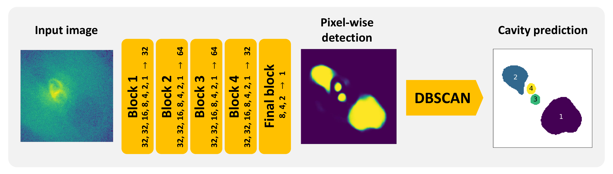

# *CAvity DEtection Tool* (CADET)
CADET is a machine learning pipeline trained for identification of surface brightness depressions (X-ray cavities) on noisy *Chandra* images of elliptical galaxies. The pipeline consists of a convolutional neural netwrok trained for producing pixel-wise cavity predictions, which are decomposed into individual cavities using clustering algorithm (DBSCAN). 

The pipeline was developed as a part of my [Diploma thesis](pdfs/diploma_thesis.pdf) to improve the automation and accuracy of the detection and size-estimation of X-ray cavities. The architecture of the convolutional netwrok is inspired by [Fort et al. 2017](https://ui.adsabs.harvard.edu/abs/2017arXiv171200523F/abstract) and the used clustering algorithm is the *Sklearn* implementation of the Density-based spatial clustering of applications with noise (DBSCAN, [Ester et al. 1996](https://citeseerx.ist.psu.edu/viewdoc/summary?doi=10.1.1.121.9220). 

