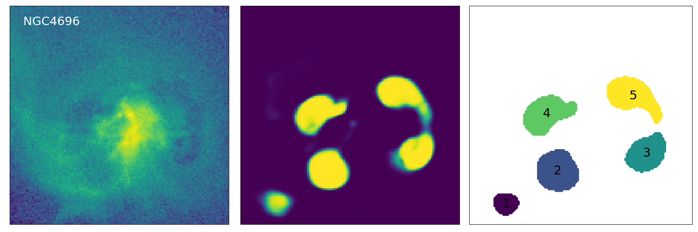
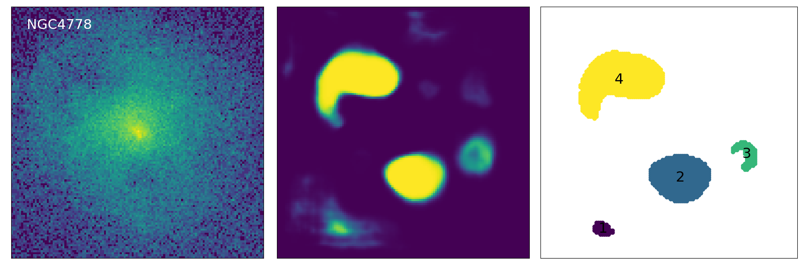
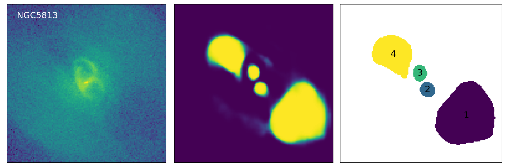

# *Cavity Detection Tool* (CADET)

[CADET](https://tomasplsek.github.io/CADET/) is a machine learning pipeline trained for identifying surface brightness depressions (so-called *X-ray cavities*) on noisy *Chandra* images of elliptical galaxies. The pipeline consists of a convolutional neural network trained for producing pixel-wise cavity predictions, which are afterwards decomposed into individual cavities using a DBSCAN clustering algorithm.

The pipeline was developed as a part of my [Diploma thesis](https://is.muni.cz/th/x68od/?lang=en) ([pdf](pdfs/diploma_thesis.pdf)) to improve the automation and accuracy of the detection and size-estimation of X-ray cavities. The architecture of the convolutional network consists of 5 convolutional blocks, each resembling an inception layer, and it's development was inspired by [Fort et al. 2017](https://ui.adsabs.harvard.edu/abs/2017arXiv171200523F/abstract) and [Secká 2019](https://is.muni.cz/th/rnxoz/?lang=en;fakulta=1411). The utilized clustering algorithm is the *Sklearn* implementation of the Density-Based Spatial Clustering of Applications with Noise (DBSCAN, [Ester et al. 1996](https://citeseerx.ist.psu.edu/viewdoc/summary?doi=10.1.1.121.9220)).


---

## Requirements

libraries required for using the CADET pipeline:\
`astropy`\
`keras`\
`matplotlib`\
`numpy`\
`scipy`\
`sklearn`\
`tensorflow`\
`plotly` (optionaly)

additional libraries for data generation:\
`concurrent`

---

## Usage

The CADET pipeline inputs either raw *Chandra* images with units of counts (numbers of captured photons) or normalized processed background-subtracted and/or exposure-corrected images. When using flux images for instance, try normalizing them by the lowest pixel value so all pixel values are higher than or equal to unity. The input image is afterwards automatically scaled by a logarithm and normalized by the highest pixel value. Currently only 128x128 images are supported, however, an improvement that would enable arbitrarily sized images is under development (so-far the images were cropped and re-binned via ciao_contrib (CIAO 4.13), however, an Astropy version is being developed).

Both the ***CADET_search*** and ***CADET_size*** pipelines are composed as selfstanding scripts. Discrimination threshold for the ***CADET_search*** pipeline was set to 0.9 to supress false positive detections, while the threshold of the ***CADET_size*** pipeline was set to 0.55 so the predicted volumes are not underestimated nor overestimated (for more info see the [Diploma thesis](pdfs/diploma_thesis.pdf)). However, the thresholds of both pipelines are changeable and can be set to an arbitrary value between 0 and 1.

The scripts can be run by simply calling (possibly with a threshold parameter - float from 0 to 1):

```console
$ python3 CADET_size.py foldername [threshold]
```

and

```console
$ python3 CADET_search.py foldername [threshold]
```

which uses all `.fits` files in the corresponding folder (`foldername`) and saves their raw cavity predictions into the `.fits` files while also properly preserving the WCS coordinates. On the output there is also a `.png` file showing decomposed cavities and a `.txt` file containing calculated areas and cavity volumes.

The volumes of X-ray cavities are calculated under the assumption of a symmetry along the direction from the galactic centre into the centre of the cavity (*center of mass*). The cavity depth in each point along that direction is assumed to be equal to its width. Thereby produced 3D cavity models can be alternatively viewed or stored in the `.npy` format for further use (e.g. cavity energy calculation)

### Convolutional part

The convolutional part can be used separately to produce raw pixel-wise predictions. Since the architecture of the convolutional network was implemented using the functional *Keras* API, the architectures together with trained weights could have been stored in the HDF5 format (*CADET_size.h5*, *CADET_search.h5*). The trained models can be simply loaded using the `load_model` *Keras* function.

```python
from keras.models import load_model
from keras.layers import LeakyReLU

model = load_model("CADET_size.h5", custom_objects = {"LeakyReLU": LeakyReLU})

y_pred = model.predict(X)
```

The network inputs 128x128 images. However, to maintain the compatibility with *Keras*, the input needs to be reshaped as `X.reshape(1, 128, 128, 1)` for single image or as `X.reshape(len(X), 128, 128, 1)` for multiple images.

---

## Example

Here we present an example of the pipeline being used on real *Chandra* images of giant elliptical galaxies.

[](https://colab.research.google.com/github/tomasplsek/CADET/blob/main/CADET_example_colab.ipynb) [](https://mybinder.org/v2/gh/tomasplsek/CADET/HEAD?filepath=CADET_example_binder.ipynb)





---

## Todo

The following improvements for the data generation and training processes are currently planned:

- [ ] speed up the data generation using *Tensorflow* and GPU
- [ ] enable inputting arbitrarily sized images
- [ ] add other features (cold fronts, point sources)
- [ ] improve existing features (bright rims, gas sloshing)
- [ ] examine various other CNN architectures
- [ ] restrict the cavity predictions using output regularization