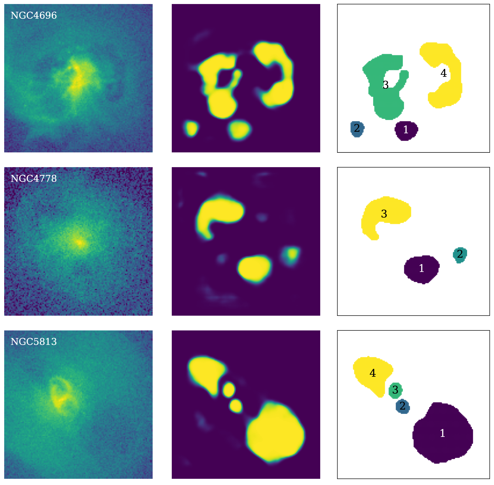

# *CAvity DEtection Tool* (CADET) (!WORK IN PROGRESS!)
CADET is a machine learning pipeline trained for identification of surface brightness depressions (X-ray cavities) on noisy *Chandra* images of elliptical galaxies. The pipeline consists of a convolutional neural netwrok trained for producing pixel-wise cavity predictions, which are afterwards decomposed into individual cavities using a clustering algorithm (DBSCAN).

The pipeline was developed as a part of my [Diploma thesis](pdfs/diploma_thesis.pdf) (not defended yet) to improve the automation and accuracy of the detection and size-estimation of X-ray cavities. The architecture of the convolutional netwrok consists of 5 convolutional block, each resembling an inception layer, and it was inspired by [Fort et al. 2017](https://ui.adsabs.harvard.edu/abs/2017arXiv171200523F/abstract) and [Secká 2019](https://is.muni.cz/th/rnxoz/?fakulta=1411). The utilized clustering algorithm is the *Sklearn* implementation of the Density-Based Spatial Clustering of Applications with Noise (DBSCAN, [Ester et al. 1996](https://citeseerx.ist.psu.edu/viewdoc/summary?doi=10.1.1.121.9220)).


The convolutional neural network was trained on artificial images which were produced from generated 3D beta models ([Cavaliere et al. 1978](https://ui.adsabs.harvard.edu/abs/1978A%26A....70..677C/abstract)) into which we randomly inserted ellipsoidal cavities. The parameter ranges and distributions used for generating the galaxy models and X-ray cavities were estimated from the measurements (for more info see the [Diploma thesis](pdfs/diploma_thesis.pdf)). Besides the cavities, we added also other typical features such as central point sources, bright rims around cavities and antisymetric spiral perturbation resembling gas sloshing to imitate the gas distribution of real galaxies (see image below). The produced models were summed into 2D images a noised using Poisson statistics to resemble real *Chandra*-like images. The corresponding labels were produced similarly by summing the cavity masks into 2D images and binning them to contain either ones (inside cavity) and zeros (outside of it).


We have trained two separate networks using different sets of artificial images: one purely with galaxies containing cavities and second with 50 percent of galaxies lacking any cavities. The first network (***CADET_size***) was further optimized for proper estimation of cavity sizes, while the second (***CADET_search***) network was tuned to suppres false positive cavity predictions.

For both of the networks, we generated 300 000 aritificial images and corresponding cavities for training, 10 000 for validation and 10 000 for testing of the network. Their parameters were, however, drawn from identical ranges and distributions. Using 64 cores on Intel Xeon Silver 4216 CPU the generation process took nearly 18 hours. The dataset was generated by the `generator.py` script, which loads the parameters distributions stored in the `CADET_size_params.csv` and `CADET_search_params.csv` files and uses beta model class in the `beta_model.py` module. Functions for 3D array rotations and ellipsoids generations contained in the `beta_model.py` module are inspired by the [pyellipsoid](https://pypi.org/project/pyellipsoid/) package.

---

## Requirements

libraries required for using the CADET pipeline:\
`numpy`\
`scipy`\
`matplotlib`\
`keras`\
`sklearn`\
`tensorflow`

additional libraries for data generation:\
`astropy`\
`concurrent`

---

## Usage

Both the ***CADET_search*** and ***CADET_size*** pipelines are composed as selfstanding scripts. Discrimination threshold for the ***CADET_search*** pipeline was set 0.9 to supress false positive detections, while the threshold of the ***CADET_size*** pipeline was set to 0.55 so the predicted volumes are not underestimated nor overestimated (for more info see the [Diploma thesis](pdfs/diploma_thesis.pdf)). However, the thresholds of both pipelines are changeable and can be set to an arbitrary value between 0 and 1.

The scripts can be run by simply calling (possibly with a threshold parameter - float from 0 to 1):

```console
$ python3 CADET_size.py foldername [threshold]
```

and

```console
$ python3 CADET_search.py foldername [threshold]
```

which uses all `.fits` files in the corresponding folder (`foldername`) and saves their cavity predictions into back into the `.fits` format while also properly preserving the WCS coordinates. On the output there is also a `decomposed.png` file of decomposed cavities and a `predictions.txt` file containing calculated areas and cavity volumes.

The volumes of X-ray cavities are calculated under the assumption of a symmetry along the direction from the galactic centre into the centre of the cavity (*center of mass*). The cavity depth in each point along that direction is assumed to be equal to its width.

### Convolutional part

The convolutional part can be used separately to produce the raw pixel-wise predictions. Since the architecture of the convolutional network was implemented using the functional *Keras* API, the architectures together with trained weights could have been stored in the HDF5 format (*CADET_size.h5*, *CADET_search.h5*). The trained models can be simply loaded using the `load_model` *Keras* function.

```python
from keras.models import load_model
from keras.layers import LeakyReLU

model = load_model("CADET_size.h5", custom_objects = {"LeakyReLU": LeakyReLU})

y_pred = model.predict(X)
```

The network inputs 128x128 images. However, to maintain the compatibility with *Keras*, the input needs to be reshaped as `X.reshape(1, 128, 128, 1)` for single image or as `X.reshape(len(X), 128, 128, 1)` for multiple images.

---

## Example

Here we present an example of the pipeline being used on real *Chandra* images of giant elliptical galaxies.



---

## Todo

The following improvements for the data generation and training processes are currently planned:

- [ ] speed up the data generation using *Tensorflow* and GPU
- [ ] add other features (cold fronts, point sources)
- [ ] improve existing features (birght rims, gas sloshing)
- [ ] examine various other CNN architectures
- [ ] restrict the cavity predictions using output regularization