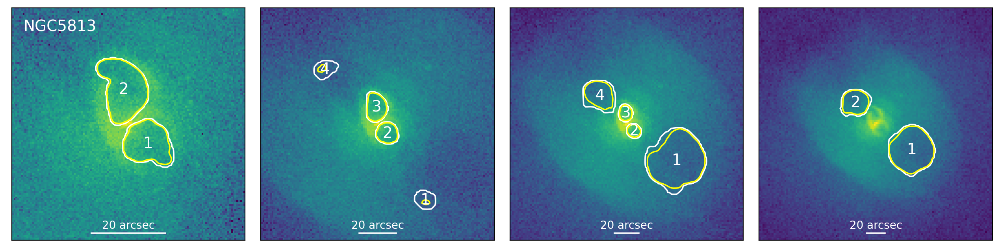
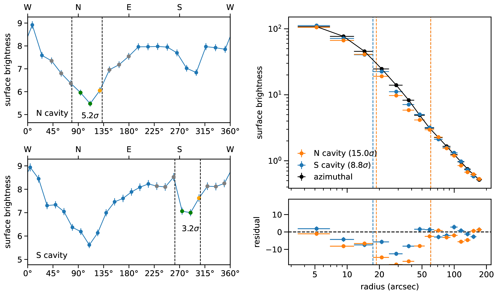
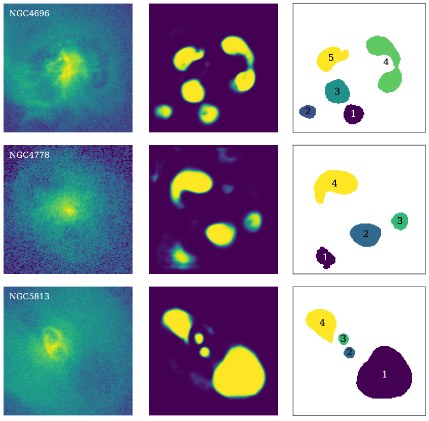

# *Cavity Detection Tool* (CADET)

[CADET](https://tomasplsek.github.io/CADET/) is a machine learning pipeline trained for identification of surface brightness depressions (so-called *X-ray cavities*) on noisy *Chandra* images of early-type galaxies and galaxy clusters. The pipeline consists of a convolutional neural network trained for producing pixel-wise cavity predictions and a DBSCAN clustering algorithm, which decomposes the predictions into individual cavities.

The pipeline was developed in order to improve the automation and accuracy of X-ray cavity detection and size-estimation. The architecture of the convolutional network consists of 5 convolutional blocks, each resembling an Inception layer, and it's development was inspired by [Fort et al. 2017](https://ui.adsabs.harvard.edu/abs/2017arXiv171200523F/abstract) and [Secká 2019](https://is.muni.cz/th/rnxoz/?lang=en;fakulta=1411). For clustering, we utilized is the *Scikit-learn* implementation of the Density-Based Spatial Clustering of Applications with Noise (DBSCAN, [Ester et al. 1996](https://citeseerx.ist.psu.edu/viewdoc/summary?doi=10.1.1.121.9220)).


## Requirements

For simple usage of the CADET pipeline, following libraries are required:\
`matplotlib`\
`astropy`\
`numpy`\
`scipy`\
`sklearn`\
`keras`\
`tensorflow`

If you want to re-train the network from scratch or generate training images, additional libraries are required:\
`concurrent`\
[`jax`](https://github.com/google/jax)

For cavity significance estimation (`cavity_significance.py`), additional `ciao_contrib` ([CIAO](https://cxc.harvard.edu/ciao/)) library is required.  (We recommend firstly installing CIAO with [Anaconda](https://www.anaconda.com/products/individual) and adding required libraries later. We note, however, that we experienced compatibility issues between CIAO library and GPU-supported versions of Tensorflow and JAX libraries. We therefore recommned installing either CPU-only version of Tensorflow alongside CIAO for simple ***CADET*** usage and significance estimation or GPU-supported Tensorflow and JAX without CIAO for re-training of the network or using separate Anaconda environments for each of these purposes.)


## Usage

The ***CADET*** pipeline inputs either raw *Chandra* images in units of counts (numbers of captured photons) or normalized background-subtracted and/or exposure-corrected images. When using e.g. corrected flux images, images should be normalized by the lowest pixel value so all pixel values are higher than or equal to 1. For images with many point sources, we recommend filling point sources with surrounding background level using Poisson statistics ([dmfilth](https://cxc.cfa.harvard.edu/ciao/ahelp/dmfilth.html) within [CIAO](https://cxc.harvard.edu/ciao/)).

Convolutional part of the ***CADET*** pipeline can only input 128x128 images. As a part of the pipeline, input images are therefore being cropped to a size specified by parameter scale (size = scale * 128 pixels) and re-binned to 128x128 images. By default, images are probed on 4 different scales (1,2,3,4). The size of the image inputted into the pipeline therefore needs to at least 512x512 pixels (minimal input size differs if non-default scales are used). Currently the re-binning is done using Astropy and Numpy libraries and can only handle integer binsizes. For floating point number binning, we recommend using [dmregrid](https://cxc.cfa.harvard.edu/ciao/ahelp/dmregrid.html) within [CIAO](https://cxc.harvard.edu/ciao/) and applying ***CADET*** model manually (see Convolutional part).

Before being decomposed by the DBSCAN algorithm, pixel-wise predictions produced by the convolutional part of the ***CADET*** pipeline need to be further thresholded. In order to simultaneously calibrate the volume error and false positive rate, we introduced two discrimination thresholds (for more info see the Paper??) and their default values are 0.4 and 0.7, respectively. Nevertheless, both discrimination thresholds are changeable and can be set to an arbitrary value between 0 and 1.

The ***CADET*** pipeline is composed as a self-standing Python script (`CADET.py`), which can be run by simply calling it from a terminal using following arguments:\
`galaxy` - string, name of the source (fits file)\
`threshold1` - float, between 0 and 1, calibrates volume error, optional (default: 0.4)\
`threshold2` - float, between 0 and 1, calibrates false positive rate, optional (default: 0.7)

```console
$ python3 CADET.py filename [threshold1] [threshold2]
```

Example:

```console
$ python3 CADET.py NGC5813
$ python3 CADET.py NGC5813 0.5 0.9
```

The script loads a FITS file specified by `galaxy` argument (`f"{galaxy}.fits"`) located in the same folder as the script, creates a folder of the same name and saves corresponding pixel-wise as well as decomposed cavity predictions into the FITS format while also properly preserving the WCS coordinates. On the output, there is also a PNG file showing decomposed predictions for individual scales.
 <!-- and a TXT file containing calculated cavity areas and volumes. -->

<!-- The volumes of X-ray cavities are calculated under the assumption of symmetry along the direction from the galactic centre into the centre of the cavity (calculated as *center of mass*). The cavity depth in each point on that line is assumed to be equal to its width (perpendicular to that line). Thereby produced 3D cavity models can be alternatively viewed or stored in the `.npy` format for further use (e.g. cavity energy calculation) -->



### Convolutional part

The convolutional part of the pipeline can be used separately to produce raw pixel-wise predictions. Since the convolutional network was implemented using the functional *Keras* API, the architecture together with trained weights could have been stored in the HDF5 format (*CADET.hdf5*). Trained model can be therefore simply loaded using the `load_model` *Keras* function:

```python
from keras.models import load_model

model = load_model("CADET.hdf5")

y_pred = model.predict(X)
```

The CNN network inputs 128x128 images, however, to maintain the compatibility with *Keras*, the input needs to be reshaped as `X.reshape(1, 128, 128, 1)` for single image or as `X.reshape(X.shape[0], 128, 128, 1)` for multiple images.

<!-- Thus produced pixel-wise prediction needs to be further thresholded and decomposed into individual cavities using a DBSCAN clustering algorithm:

```python
import numpy as np
from sklearn.cluster import DBSCAN

y_pred = np.where(y_pred > threshold, 1, 0)

x, y = y_pred.nonzero()
data = np.array([x,y]).reshape(2, -1)

clusters = DBSCAN(eps=1.5, min_samples=3).fit(data.T).labels_
``` -->

### Cavity significance estimation

The significance of detected cavities can be estimated using the `cavity_significance.py` python script ([CIAO](https://cxc.harvard.edu/ciao/) library required). The script takes the following arguments:\
`galaxy` - string, name of the source (fits file)\
`scale` - int, scale of the image {1,2,3,4}\
`cavities` - list, list of cavities to be analyzed\
`beta_model` - string, beta model to be fitted to radial profile {single, double}, optional (default: single)

Usage: 
```console
$ python3 cavity_significance.py galaxy scale cavities [beta_model]
```
Example: 
```console
$ python3 cavity_significance.py NGC4649 1 [1,2]
$ python3 cavity_significance.py NGC4649 1 [1,2] single
$ python3 cavity_significance.py NGC5813 2 [3,5] double
```

#### Exemplary output for galaxy NGC4649



## Example

Here we present an example of the pipeline being used on real *Chandra* images of giant elliptical galaxies.

[](https://colab.research.google.com/github/tomasplsek/CADET/blob/main/CADET_example_colab.ipynb)



## How to cite

CADET pipeline was originally developed as a part of my [diploma thesis](https://is.muni.cz/th/x68od/?lang=en) and was further described in [Plšek et al. 2023](https://ui.adsabs.harvard.edu/abs/2022MNRAS.517.3682P/abstract). If you use the CADET pipeline in your research, please cite the following paper:

```
@ARTICLE{2023MNRAS.517.3682P,
       author = {{Pl{\v{s}}ek}, T. and {Werner}, N. and {Topinka}, M. and {Simionescu}, A. and {Allen}, S.~W.},
        title = "{CAvity DEtection Tool (CADET): Pipeline for automatic detection of X-ray cavities in atmospheres of early-type galaxies}",
      journal = {\mnras},
         year = 2023,
       volume = {517},
       number = {3},
        pages = {3682-3710},
          doi = {10.1093/mnras/stac2770},
       eprint = {2203.15809}
}
```

## Todo

The following improvements for the data generation and training process are currently planned:

- [ ] simulate images using PyXsim/SOXS
- [ ] add other features (cold fronts, point sources)
- [ ] replace DBSCAN by using instance segmentation 
- [ ] restrict the cavity number and shape using regularization?
<!-- - [ ] enable inputting arbitrarily sized images -->
